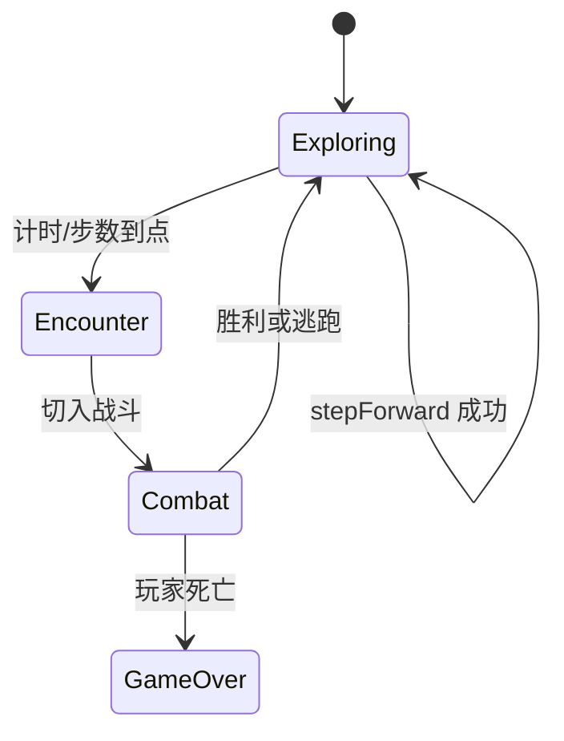
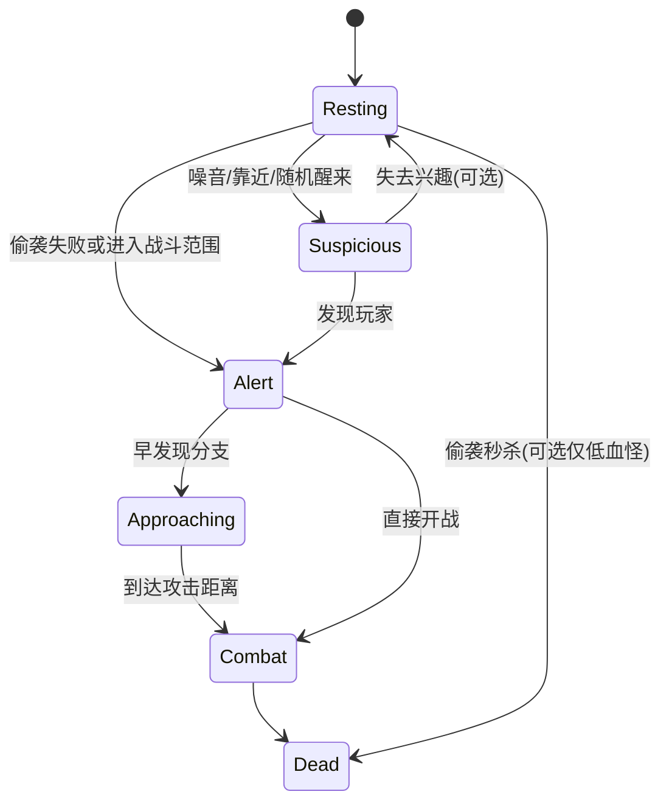

# 战斗系统方案（草案 · 待你确认）

> 目标：在**前进隧道**过程中，每隔一段时间遭遇怪物；首版以**单怪遭遇**为主，强调「休息可偷袭」与「读条技能」的回合感。  
> 技术栈：**Cocos Creator 3.8 + 微信小游戏**，与现有 `TunnelForwardController` 前进流程衔接。

---

## 1. 设计支柱（建议默认）

| 支柱 | 说明 |
|------|------|
| **遭遇穿插前进** | 前进 ≠ 纯走路；每 X 秒（或每 N 步）触发一次遭遇，短暂进入战斗态 |
| **信息可读** | 怪物状态一眼能看懂：睡觉(zzz)、警觉、读条、普攻、远程 |
| **风险回报** | 偷袭休息怪 = 高伤害；被早发现 = 怪先手的压力 |
| **首版克制** | 先 1 只怪、2~3 种攻击、少量技能；数值与美术可后填 |

---

## 2. 与「前进」如何衔接



| 阶段 | 玩家操作 | 隧道/镜头 |
|------|----------|-----------|
| **探索 Exploring** | 点击前进、选装备 | `TunnelForwardController` 正常放大 |
| **遭遇 Encounter** | 短暂停或慢动作 0.3s | 可冻结前进输入；怪物从走廊深处「出现」 |
| **战斗 Combat** | 攻击/技能/道具 | 建议固定机位：走廊 + 怪在画面中段，双手/UI 保留 |
| **结束** | — | 恢复探索；可选回血、掉落提示 |

**触发方式（二选一，请你拍板）**

- **A. 时间**：每 `encounterIntervalSec`（如 8~15 秒）在探索态抽一次遭遇  
- **B. 步数**：每 `stepsPerEncounter` 次 `TUNNEL_STEP_DONE` 触发  

推荐 **B（与前进绑定）**，手感更可控；时间可作为副保底。

---

## 3. 遭遇规则（首版）

| 项 | 建议默认值 | 说明 |
|----|------------|------|
| 怪物数量 | **1** | 后期再加 2 只、精英 |
| 池子 | `MonsterConfig[]` | 按走廊场景 `frames` 索引过滤权重 |
| 初始状态 roll | 见 §4 | 决定睡觉 / 巡逻 / 已警觉 |
| 是否可跳过 | 否（首版） | 后期可做「绕路」技能 |

---

## 4. 怪物状态机（核心）



### 4.1 休息 `Resting`（可偷袭）

- **表现**：眯眼、头顶 **zzz** 循环（Sprite 动画或 Spine）  
- **规则**：  
  - 玩家**首次攻击**且怪物未转入 `Suspicious` → **偷袭**  
  - 伤害倍率 `sneakDamageMultiplier`（建议 **1.8~2.5**）  
  - 可选：必暴击 / 破防条  
- **风险**：偷袭前若玩家使用「前进」或 loud 技能 → 强制 `Suspicious`

### 4.2 可疑 `Suspicious`（可选首版简化掉）

- 半睁眼、zzz 消失、头转向玩家  
- 1~2 秒内未行动 → `Alert`

### 4.3 警觉 `Alert` / 接近 `Approaching`

- **早发现**：遭遇 roll 时直接 `Alert` 或 `Approaching`  
- **表现**：向玩家方向平移/缩放走来（2D 可只做 X 轴 + 轻微放大）  
- **先手**：进入 `Combat` 时怪物先获得一次「意图」或普攻（可配置）

### 4.4 战斗 `Combat`

- 回合制 **或** 半即时（见 §6 待你选）  
- 子状态：`Idle` → `Casting` → `Attacking` → `HitStun` → `Idle`

---

## 5. 怪物攻击类型

| 类型 | 玩家可见信号 | 实现要点 |
|------|--------------|----------|
| **普攻 Melee** | 短前摇 0.2~0.4s + 挥击动画 | 伤害即时，可闪避窗口（后期） |
| **远程 Ranged** | 举手/瞄准 + 飞行物 | `Projectile` 节点，命中玩家 HP |
| **技能 Skill** | **读条 UI** + 施法动画 | 见 §5.1 |

### 5.1 读条释放（你强调的重点）

1. **意图阶段**：头顶或脚下出现读条（`ProgressBar` / 自绘 Sprite 缩放）  
2. **时长**：`castTimeSec`（如 1.2~2.5s），可被「打断」否（首版建议不可打断，仅预览伤害）  
3. **动画**：`cast` 循环 → `release` 一次 → 结算伤害/特效  
4. **失败惩罚**：读条结束若玩家防御/打断（二期）则怪物硬直  

数据驱动示例（`MonsterSkillConfig`）：

```ts
{
  id: 'slime_spit',
  type: 'ranged' | 'skill',
  castTime: 1.8,
  damage: 12,
  animCast: 'cast',
  animRelease: 'release',
  telegraphColor: '#ff8800', // 读条颜色区分危险度
}
```

---

## 6. 战斗节奏（请你选一种）

| 模式 | 优点 | 缺点 |
|------|------|------|
| **A. 回合制** | 易做偷袭、读条、小程序性能稳 | 节奏偏慢 |
| **B. 半即时（推荐）** | 探索连贯；怪读条时玩家可点攻击 | 需明确「玩家行动条」是否暂停读条 |
| **C. 纯即时** | 动作感强 | 偷袭/读条难读，首版不推荐 |

**推荐 B**：怪物读条**不暂停**玩家普攻，但玩家**控制类技能**可打断（二期）；首版玩家可在读条期间普攻降低怪物 HP。

---

## 7. 玩家侧（首版最小）

| 行动 | 说明 |
|------|------|
| 普攻 | 按钮或点击怪；休息态首击 = 偷袭 |
| 前进 | 探索态专用；战斗态禁用或变为「逃跑」 |
| 技能槽 2~3 | 对齐现有 HUD 圆钮；至少 1 伤害 + 1 控制（后期） |
| HP | 沿用底部血条 `26196/29899` 风格，战斗时扣减 |

---

## 8. 模块划分（Cocos 脚本规划）

```
assets/scripts/
├── combat/
│   ├── CombatDirector.ts       # 遭遇入口、胜负、与 Tunnel 互斥输入
│   ├── EncounterScheduler.ts   # 每 X 秒 / 每 N 步触发
│   ├── MonsterController.ts    # 状态机 + 动画事件
│   ├── MonsterBrain.ts         # AI：休息/走来/选技能
│   ├── MonsterView.ts          # zzz、读条、受击闪白
│   ├── CastBarUI.ts            # 读条组件
│   ├── Projectile.ts           # 远程弹
│   └── PlayerCombat.ts         # 玩家战斗输入、偷袭判定
├── data/
│   ├── MonsterConfig.ts        # 数值、技能表、状态权重
│   └── CombatBalance.ts        # 全局倍率
└── tunnel/                     # 已有
```

**事件（扩展现有 `GameEvents`）**

- `ENCOUNTER_START` / `ENCOUNTER_END`  
- `COMBAT_START` / `COMBAT_END`  
- `MONSTER_STATE_CHANGED`  
- `CAST_START` / `CAST_RELEASE`  

`TunnelForwardController` 在 `COMBAT_START` 时 `blockInputWhileStepping = true` 并禁用 `TunnelTapArea`。

---

## 9. 分阶段实现（建议）

| 阶段 | 交付 | 可玩验证 |
|------|------|----------|
| **P0** | 文档 + 配置表结构 + 遭遇触发（无怪美术用方块） | 前进 N 次弹出「遭遇」 |
| **P1** | 单怪 FSM：Resting(zzz) + Alert 走来 + 普攻 | 偷袭伤害数字、普攻防 |
| **P2** | 远程 + 读条技能 + 施法动画占位 | 读条条满后扣血 |
| **P3** | 多怪配置、掉落、与 `TunnelSceneSequence` 关卡绑定 | 换场景换怪池 |
| **P4** | 手感：受击、死亡、胜利继续前进、音效 | 小程序真机 |

---

## 10. 需要你拍板的问题（回复编号即可）

1. **遭遇触发**：时间 / 步数 / 两者取最小？默认步数每 **3** 次前进？  
2. **战斗节奏**：A 回合 / **B 半即时** / C 即时？  
3. **偷袭**：仅首击加成，还是休息怪有概率一击必杀（小游戏向）？  
4. **早发现概率**：约 **20%** 遭遇直接 Alert 是否合理？  
5. **读条**：玩家普攻是否打断读条？（建议首版 **不打断**，减少复杂度）  
6. **怪物位置**：走廊正中 vs 偏左/右（配合左右门逻辑）？  
7. **失败**：死亡回 checkpoint / 本局结束 / 扣资源复活？  
8. **美术**：Spine / 序列帧 / 静态图 + 程序动画（zzz 用粒子或 3 帧图）？

---

## 11. 确认后的下一步

你确认 §10 后，我会：

1. 在仓库新增 `docs/COMBAT_PLAN.md` 定稿版（按你的选择改默认值）  
2. 实现 **P0 + P1** 骨架：`EncounterScheduler` + `MonsterController` + 方块怪 + 偷袭倍率  
3. 在 `EDITOR_SETUP.md` 增加战斗节点与组件绑定说明  

---

*当前为草案 v0.1，欢迎直接改文档或回复 §10 选项。*
