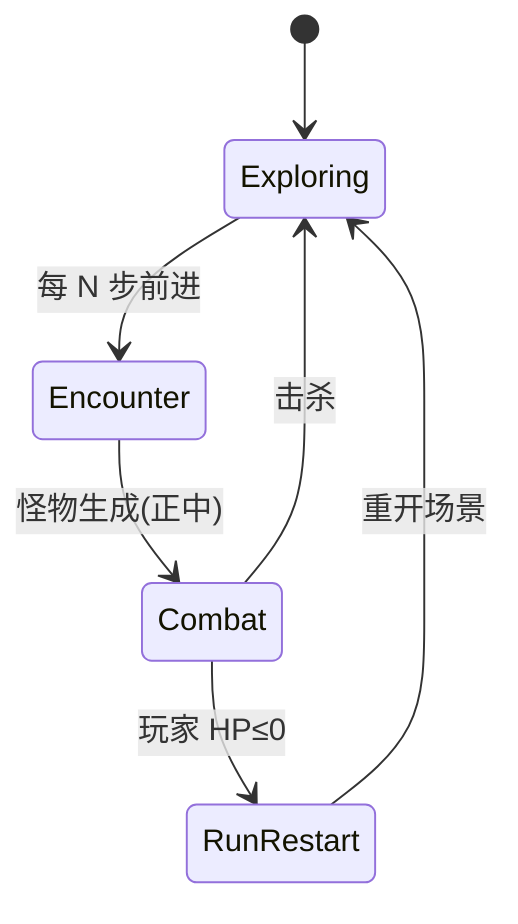

# 战斗系统方案 · 定稿 v1.0

已与产品对齐的选项如下；实现见 `assets/scripts/combat/`。

---

## 已定稿选项

| # | 议题 | 决定 |
|---|------|------|
| 1 | 遭遇触发 | **前进步数**（`EncounterScheduler.stepsPerEncounter`，默认 3） |
| 2 | 战斗节奏 | **半即时**（读条时玩家可普攻） |
| 3 | 偷袭伤害 | **+100%**（总伤害 ×2，`CombatBalance.sneakDamageMultiplier = 2`） |
| 4 | 早发现 | **20%** 遭遇直接走来开战 |
| 5 | 读条打断 | **普攻不打断**；仅后期带 `SkillTag.Interrupt` 的技能（眩晕等） |
| 6 | 站位 | **单怪 / 战士怪在正中**；后期远程偏侧 |
| 7 | 死亡 | **整局重来**（杀戮尖塔，`RunRestartController` 重载起始场景） |
| 8 | 美术 | **初期单图 + 抖动**（`MonsterView` shake / 受击闪色） |

---

## 流程



---

## 怪物状态（首版）

| 状态 | 表现 | 逻辑 |
|------|------|------|
| Resting | zzz、眯眼 | 首击 ×2 伤害并进入 Combat |
| Approaching | 单图抖动靠近 | 20% 遭遇入口 |
| Combat | 半即时 AI 选招 | 普攻/远程/读条技能 |
| Casting | 读条 UI | 不可被普攻打断 |
| Dead | 缩小消失 | 恢复探索 |

---

## 脚本与节点

| 脚本 | 作用 |
|------|------|
| `EncounterScheduler` | 监听 `TUNNEL_STEP_DONE` |
| `CombatDirector` | 遭遇 / 战斗开关、刷怪 |
| `MonsterController` | 状态机 + AI |
| `MonsterView` | zzz、抖动、受击 |
| `CastBarUI` | 读条 |
| `PlayerCombat` | 普攻、HP、`useSkill(tags)` |
| `RunRestartController` | 死亡重来 |
| `TunnelCombatGate` | 战斗时禁前进 |
| `CombatAttackButton` | UI 普攻 |

### 推荐节点（`MonsterSlot` 在走廊正中）

```
Canvas
├── TunnelRoot …
├── MonsterSlot          # 正中，挂 MonsterController + MonsterView
│   ├── Body (Sprite)
│   ├── ZzzRoot
│   └── CastBar
├── GameLogic
│   ├── EncounterScheduler
│   ├── CombatDirector
│   ├── PlayerCombat
│   ├── RunRestartController
│   └── TunnelCombatGate
└── UI / BtnAttack → CombatAttackButton
```

`eventBus` 统一指向 `GameLogic`。

---

## 后期扩展（已预留）

- `PlayerCombat.useSkill(SkillTag.Interrupt | Stun, damage)`  
- 怪物种：`melee` / `ranged` / `warrior` 站位表  
- 远程 `Projectile.ts`（P2）  

---

## 实现阶段

| 阶段 | 状态 |
|------|------|
| P0 遭遇 + 禁前进 | ✅ 脚本 |
| P1 休息/偷袭/走来/普攻/读条 | ✅ 脚本 |
| P2 远程弹道、多怪 | 待做 |
| P3 关卡怪池、掉落 | 待做 |

*文档版本：v1.0*
