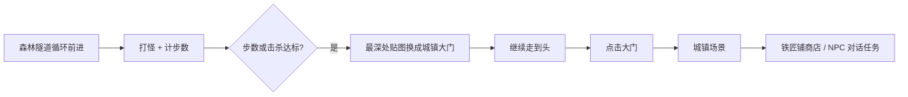

# 常规游戏开发流程 · 策划可编辑

本项目采用 **Cocos Creator 数据驱动 + 双场景（森林隧道 / 城镇）**，策划主要在**编辑器 Inspector** 改配置，无需程序员改代码。

---

## 一、整体流程（与你描述一致）



| 阶段 | 场景 | 策划配置组件 |
|------|------|----------------|
| 探索战斗 | `Game`（隧道+战斗） | `GameChapterConfig` |
| 进城 | `Town` | `ShopCatalog`、`NpcCatalog` |

---

## 二、森林关：策划改什么（Inspector）

在 **GameLogic** 上挂 **`GameChapterConfig`**：

| 字段 | 说明 | 示例 |
|------|------|------|
| tunnelLoopFrames[] | 隧道循环美术帧 | 森林1、森林2、森林3 |
| stepsToRevealGate | 累计前进次数 | 12 |
| killsToRevealGate | 累计击败怪物 | 5 |
| requireBothForGate | 是否两个都要满足 | false = 满足任一即可 |
| gateFrame | **城镇大门**图（替换最深处） | 城门 SpriteFrame |
| stepsAfterGateToEnter | 大门出现后走几步可点 | 1 |
| townSceneName | 进城场景名 | Town |
| stepsPerEncounter | 每几步遇怪 | 3 |
| stopEncountersAfterGate | 大门出现后是否停怪 | true |

关联脚本（程序搭一次，策划只填表）：

| 脚本 | 作用 |
|------|------|
| `GameFlowController` | 同步遭遇、击杀计数 |
| `TunnelChapterController` | 计步/计杀、换大门图、显示提示 |
| `TunnelSceneSequence` | 隧道帧循环 |
| `GateInteract` | 点击大门 `loadScene(Town)` |

### 节点建议（森林场景）

```
Canvas
├── TunnelRoot (Frame / Inner …)
├── DeepLayer (Sprite)          ← deepLayerSprite，尽头贴图；大门出现时换 gateFrame
├── GateInteract (透明按钮)      ← 大门可点时 active
├── GateHint (Label)            ← 「点击大门进入城镇」
├── MonsterSlot …
└── GameLogic
    ├── GameChapterConfig       ← 策划主入口
    ├── GameFlowController
    ├── TunnelChapterController
    └── EncounterScheduler …
```

**隧道循环**：`tunnelLoopFrames` 交给 `TunnelSceneSequence`，`loopSequence = true`，直到大门揭示后自动 `false`。

---

## 三、城镇场景：策划改什么

新建场景 **`Town`**（Build Settings 勾选），背景用你提供的街道图（铁匠铺左、炼金铺右）。

```
Canvas
├── TownBackground (Sprite 整图)
├── Hotspot_Blacksmith (TownHotspot + 碰撞区)
├── Hotspot_Alchemy
├── Hotspot_NpcSmith
├── UI
│   ├── ShopPanel
│   └── DialoguePanel
└── TownLogic
    ├── ShopCatalog_Blacksmith   (shopTitle=铁匠铺, items[])
    ├── ShopCatalog_Alchemy
    ├── NpcCatalog                 (npcs[] 对话/任务选项)
    └── TownDirector
```

### 商店（铁匠铺 = 商店功能）

**`ShopCatalog`** 组件：

- `shopTitle`：铁匠铺  
- `items[]`：每条 `ShopItemRow`（名称、价格、库存）

**`TownHotspot`**：`kind = Shop`，`shopId = Blacksmith`，拖到对应 `ShopCatalog` 和 `ShopPanel`。

### NPC（聊天 / 任务）

**`NpcCatalog`** → `npcs[]`：

- `greeting`：开场白  
- `options[]`：`label` 显示文字，`actionType`：`chat` / `quest_accept` / `close`

**`TownHotspot`**：`kind = Npc`，`npcId` 与配置一致。

后期任务系统只需监听事件 `dialogue-option`，按 `actionType` 分支。

---

## 四、常规团队协作方式

| 角色 | 工作 |
|------|------|
| **策划** | 改 `GameChapterConfig`、商店表、NPC 表；对照 `resources/config/*.json` 做数值文档 |
| **美术** | 出隧道帧、大门、城镇横版、店铺招牌；拖 SpriteFrame |
| **程序** | 新机制时加脚本；新关卡复制 GameLogic Prefab 改 Config |
| **测试** | 微信开发者工具真机；调步数/击杀门槛 |

### 扩展新关卡

1. 复制 `Game` 场景 → `Game_chapter02`  
2. 换 `GameChapterConfig` 的帧与门槛  
3. 大门后进城或进下一章隧道  

### 可选：Excel → JSON

表结构可与 `chapter_forest_01.json` 对齐，工具导出后给程序导入；**首版推荐直接用 Creator 组件数组**，所见即所得。

---

## 五、脚本目录

```
assets/scripts/
├── flow/          GameChapterConfig, TunnelChapterController, GateInteract
├── town/          ShopPanel, DialoguePanel, TownHotspot
├── tunnel/        前进、隧道
└── combat/        半即时战斗
```

---

## 六、自检清单

- [ ] 前进 12 步或杀 5 只怪后，深处变为大门图  
- [ ] 再前进 1 步，出现可点大门与提示  
- [ ] 点击进入 Town 场景  
- [ ] 左侧铁匠铺打开商店 UI，可“购买”扣金币  
- [ ] 点击 NPC 出现对话与选项  

*文档版本：v1.0*
